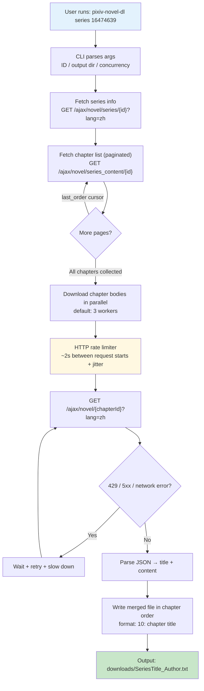
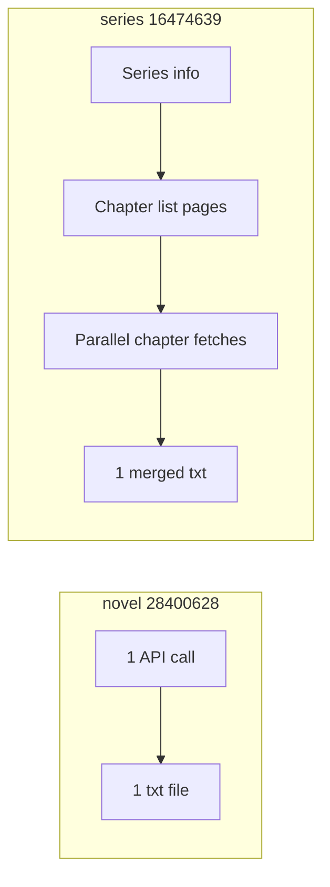
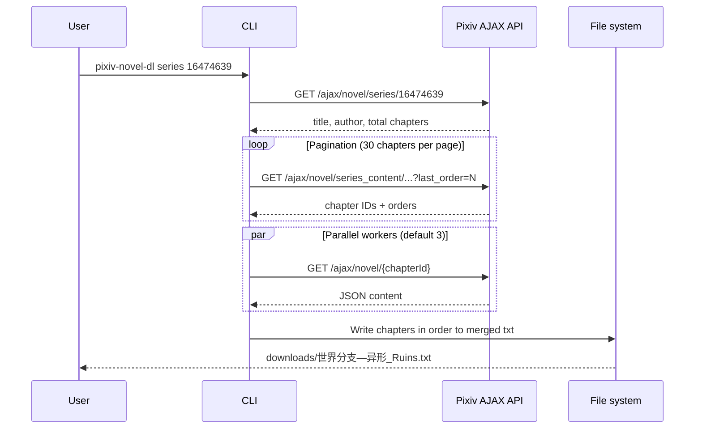
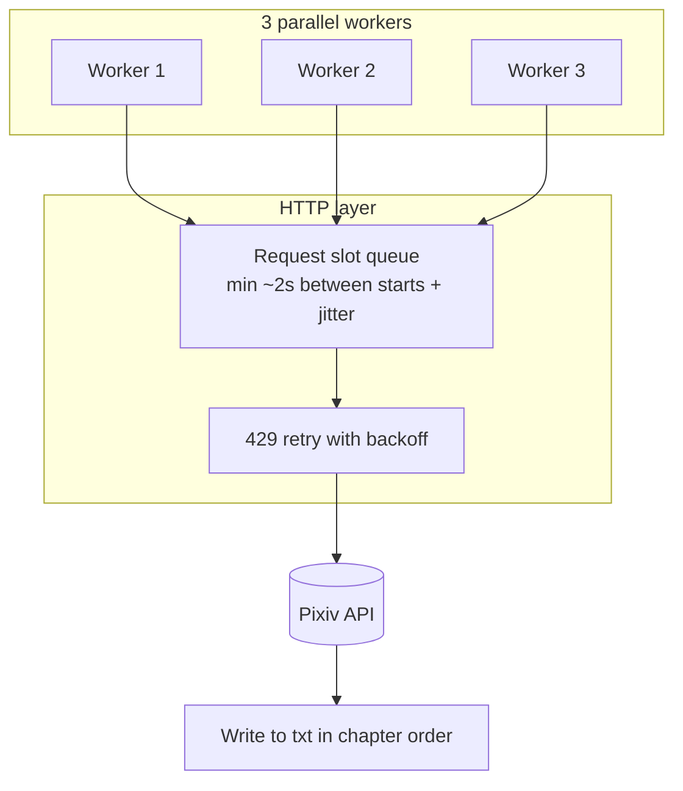

# Architecture

This tool does **not** scrape HTML pages. It calls the same Pixiv **AJAX JSON APIs** that the website uses in your browser, then writes the `content` field to plain-text files.

No browser or login is required for most public novels.

## Overall download flow



## Single novel vs series



## Series download phases



## API endpoints

| Step | Endpoint | Returns |
|------|----------|---------|
| Series metadata | `/ajax/novel/series/{seriesId}?lang=zh` | Title, author, chapter count |
| Chapter list | `/ajax/novel/series_content/{seriesId}?limit=30&last_order=0&order_by=asc&lang=zh` | Chapter IDs (paginated) |
| Chapter body | `/ajax/novel/{novelId}?lang=zh` | Title, author, full text |

Required headers (same as a browser):

- `Referer`: matching Pixiv page URL
- `Accept`: `application/json`
- `User-Agent`: standard browser string

Implementation lives in `src/api.ts` and `src/http.ts`.

## Parallel downloads and rate limiting



- **Fast part (parallel):** chapter body downloads run concurrently via `pool.ts` (default 3 workers).
- **Slow part (serial):** merged file is written in chapter order after all fetches complete.
- **HTTP pacing:** `http.ts` enforces a minimum interval between request starts, with random jitter.
- **429 handling:** exponential backoff retry (up to 5 attempts); interval increases after rate-limit hits.
- **`--slow` mode:** 1 worker only, longer delays — use when hitting 429.

Default values are defined in `src/constants.ts`.

## Merged file format

```
世界分支—异形
Author: Ruins

1: 前言

(chapter 1 body...)

2: 序章

(chapter 2 body...)
```

Each chapter section is `{order}: {title}` followed by the body text. Formatting logic is in `src/downloader.ts` and `src/utils.ts`.
